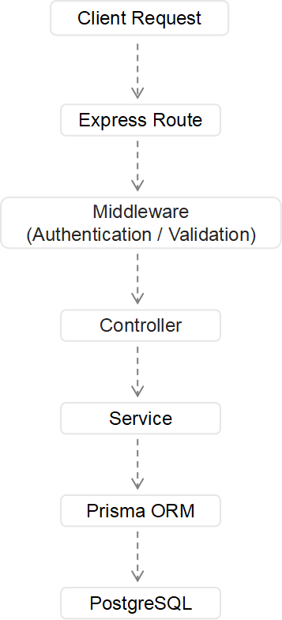

# Expense Tracker API

A RESTful API for the Expense Tracker application, built with Node.js, Express, TypeScript, Prisma and PostgreSQL.
The API provides secure user authentication, user specific expense management, input validation, and persistent data storage.

## Related Application

**Live Application:** https://expense-tracker-me-2740.vercel.app

**Frontend Repository:** https://github.com/xyypsy1234-dotcom/expense-tracker

## API Features

### Authentication

- User registration and login
- Password hashing with bcrypt
- JWT-based authentication
- Secure HttpOnly cookie storage
- Authentication middleware for protected routes
- Session restoration through the current user endpoint
- Secure logout by clearing the authentication cookie

### Expense Management

- Create, retrieve, update, and delete expenses
- User specific expense ownership
- Authorization checks for expense operations
- Input validation with Zod
- Persistent PostgreSQL storage through Prisma ORM

### Error Handling

- Centralized error handling middleware
- Custom application errors
- Validation error responses
- Database error handling
- Appropriate HTTP status codes

## Tech Stack

### Backend

- Node.js
- Express 5
- TypeScript
- Zod
- Prisma ORM
- JWT (JSON Web Token)
- bcrypt
- cookie-parser
- CORS

### Database

- PostgreSQL
- Neon

### Deployment

- Render -Backend API
- Neon -PostgreSQL database

## Architecture

The backend follows a layered architecture that separates routing, authentication, request handling, business logic, and database access.



### Request Flow

**Routes:** define API endpoint and connect requests to middleware and controllers

**Middleware:** handle authentication, validation, and request processing

**Controllers:** receive HTTP requests and return HTTP responses

**Services:** contain business logic and interact with the database

**Prisma ORM:** provide type safe database access

**PostgreSQL:** stores user and expense data

## API Endpoint

### Authentication

| Method | Endpoint                | Authentication | Description                                          |
| ------ | ----------------------- | -------------- | ---------------------------------------------------- |
| POST   | `/api/auth/register`    | No             | Register a new user                                  |
| POST   | `/api/auth/login`       | No             | Log in and create an authenticated session           |
| GET    | `/api/auth/me`          | Yes            | Get the currently authenticated user                 |
| POST   | `/api/auth/logout`      | Yes            | Log out and clear the authentication cookie          |
| POST   | `/api/auth/check-email` | No             | Check whether an email address is already registered |

### Expense

| Method | Endpoint            | Authentication | Description                                           |
| ------ | ------------------- | -------------- | ----------------------------------------------------- |
| GET    | `/api/expenses`     | Yes            | Get all expenses belonging to the authenticated user  |
| POST   | `/api/expenses`     | Yes            | Create a new expense                                  |
| PUT    | `/api/expenses/:id` | Yes            | Update an expense belonging to the authenticated user |
| DELETE | `/api/expenses/:id` | Yes            | Delete an expense belonging to the authenticated user |

## Authentication & Authorization

Authentication is implemented using JSON WEB TOKEN(JWT).
After a successful login, the backend generates a JWT and stores it in a secure HttpOnly cookie. The browser automatically includes the cookie with authenticated API requests.
Protect routes use authentication middleware to verify the JWT and identify the current user.
Expense operations are scoped to the authenticated user's ID. This prevents one user from retrieving, updating, or deleting expenses that belong to another account. In production, authentication cookies are configured with secure cross site settings to support communication between the Vercel frontend and the Render backend over HTTPS.

## Database

The application uses PostgreSQL as its relational database and Prisma ORM for database access. The main data model consists of users and expenses. Each expense belongs to single user, while a user can have multiple expenses. Expense queries are scoped by the authenticated user's ID to enforce data ownership at the backend level. Database migrations and schema management are handled with prisma.

## Getting Started

### Prerequisites

Before running the API locally, make sure you have:

- Node.js
- npm
- A PostgreSQL database

### Installation

1. Clone the repository

```bash
git clone https://github.com/xyypsy1234-dotcom/expense-tracker-api.git
```

2. Navigate to the project directory:

```bash
cd expense-tracker-api
```

3. Install dependencies:

```bash
npm install
```

4. Create a `.env` file in the project root and configure the required environment variables.

5. Generate the Prisma Client:

```bash
npx prisma generate
```

6. Apply the database migrations:

```bash
npx prisma migrate dev
```

7. Start the development server:

```bash
npm run dev
```

The API will run locally at:

```text
http://localhost:5000
```

## Environment Variables

Create a `.env` file in the project root using `.env.example` as a reference.

```env
DATABASE_URL=your_database_url
JWT_SECRET=your_jwt_secret
PORT=5000
NODE_ENV=development
FRONTEND_URL=http://localhost:3000
```

## Available Scripts

### Development

```bash
npm run dev
```

### Production Build

```bash
npm run build
```

### Production Start

```bash
npm start
```

## Deployment

The backend API is deployed on Render and connected to a Neon PostgreSQL database.
The production environment uses:

- Render for the Express API
- Neon for PostgreSQL
- Environment variables for database credentials and JWT configuration
- HTTPS communication with the deployed frontend
- CORS with credential support
- Secure HttpOnly cookies with production specific cookie settings

The frontend is deployed separately on Vercel and communicates with this API through HTTPS.

## Future Improvements

Potential improvements for future versions include：

- Automated unit and integration testing
- API health check endpoint
- Password reset functionality
  -Email verification
- Rate limiting
- API documentation with openAPI
  -Docker-based development and deployment
